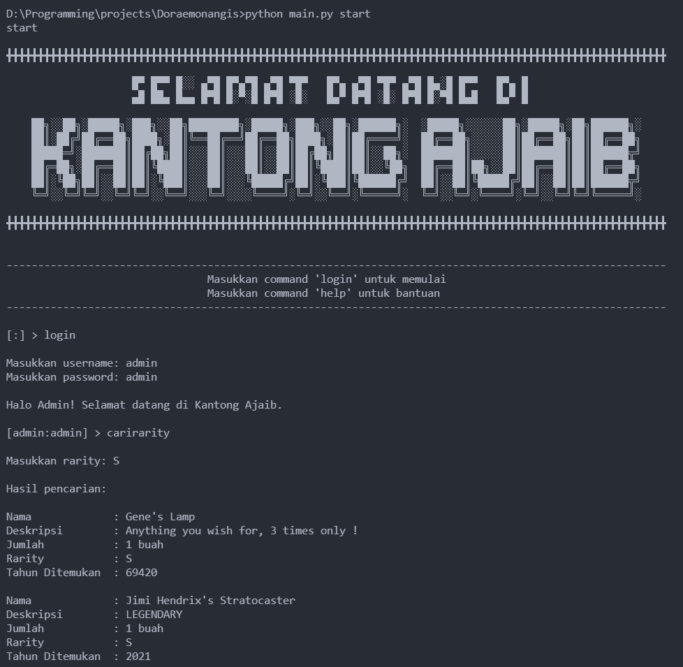

# Doraemonangis

Stashing application where the users can store, borrow, search by filter, see history, and edit things (just like doraemon's magical pocket that can store anything). There are 17 features implemented in this app including saving and loading from a csv file

For further information, please check this [specification](https://docs.google.com/document/d/1GlDVrRoQYsKrs9DKpbNUvJD_yoI35nHI4ahqDOr3GRE/edit) (bahasa indonesia)

## How to run

1. Download or clone this repository to your computer
2. Go to the project's root folder, and then open terminal
3. run the main.py file with python with this script (make sure you have python3 installed) :

```
python main.py start
```

note that `start` is a folder name at `savefiles/` folder containing the csv files needed to run the app. When you create another save folder with the `save` command in the app (example : `mysave1`), you can open that by this command :

```
python main.py <your-savefile-name>
```

In this case :

```
python main.py mysave1
```

And your file tree would be :

```
- root/
  - savefiles/
    - start/
    - mysave1/
```

4. For the commands, you can check at the specification above or type `help` at anytime to open the help menu

## Preview

</img>
